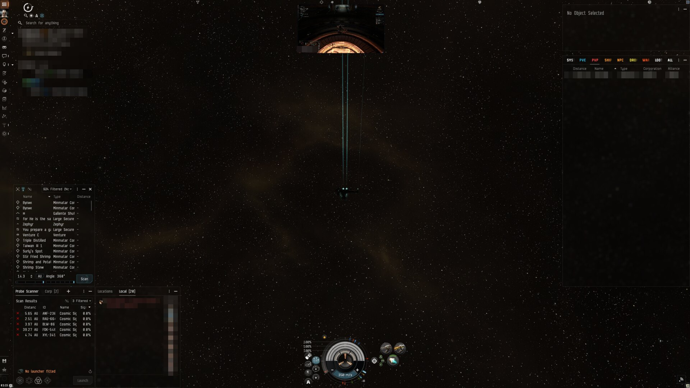
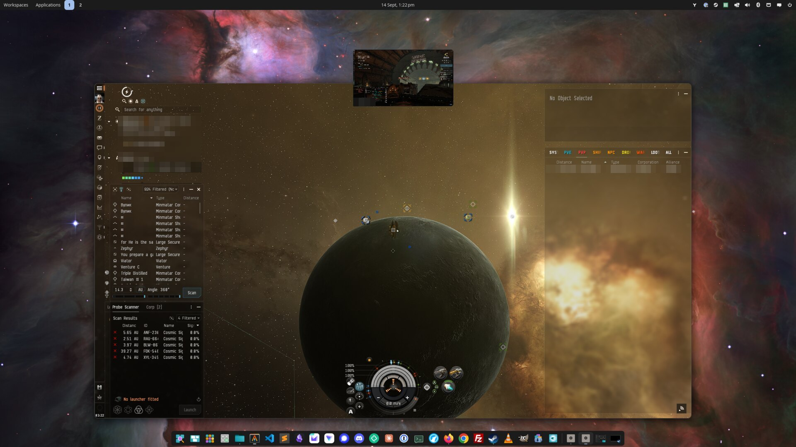
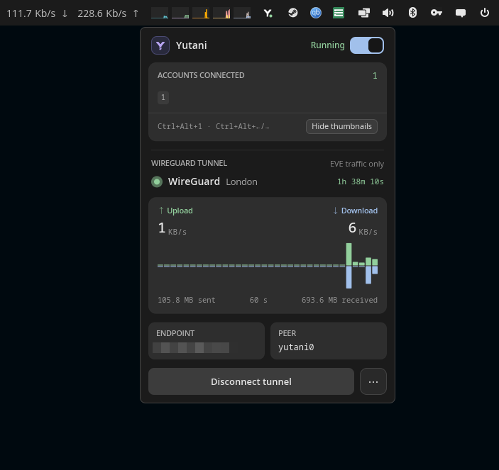

<div align="center">

# Yutani

**Live thumbnails, one-key client switching and an EVE-only WireGuard tunnel for EVE Online multiboxing on COSMIC.**

Native Wayland. No middleware, no X11 layer, no injected DLLs. Just the latest COSMIC and Wayland protocols, a GPU and a very small daemon.

[](https://www.rust-lang.org/)
[](https://system76.com/cosmic)
[](https://wayland.freedesktop.org/)
[](packaging/PKGBUILD)
[](LICENSE)
[](https://github.com/dc9090-web/yutani/releases/latest)



*Full-screen client, second account live at the top. Press `Ctrl+Alt+2` and you are there.*

</div>

---

## ✨ What it does

Yutani watches every EVE client on your desktop and gives you three things:

| | |
| --- | --- |
| 🖼️ **Live thumbnails** | Every other client, live, in a small overlay you can put anywhere. Click one to switch. |
| ⌨️ **Global hotkeys** | `Ctrl+Alt+1…9` focuses a client, `Ctrl+Alt+←/→` steps through them, `Ctrl+Alt+T` hides the overlay. Works from inside the game. |
| 🔒 **EVE-only tunnel** | All EVE traffic, and only EVE traffic, through a WireGuard exit of your choosing. Fewer hops, lower latency, kill-switch included. |

…plus a panel applet, a settings window, a character-settings copier and a CLI that drives all of it.

---

## 🚀 Built on the newest stack

Yutani is written in Rust against the protocols COSMIC ships today. Nothing is emulated, wrapped or polled.

| | Technology | Why it matters |
| --- | --- | --- |
| 🐧 | **Wayland, native** | The EVE client runs as a real Wayland toplevel under Proton (`PROTON_ENABLE_WAYLAND=1`). No XWayland, no window decorations from Wine. |
| 🪐 | **COSMIC 1.8+** | `ext-image-copy-capture` and `ext-foreign-toplevel` for per-window capture, `zwlr_layer_shell` for the overlay, COSMIC's toplevel manager for focus. `yutani doctor` lists every protocol and whether your compositor has it. |
| ⚡ | **Zero-copy capture** | Frames land in GPU `dmabuf` buffers via `gbm` and are post-processed on the GPU (scale, rounded corners). Nothing is read back to the CPU. Capture rate is yours to pick: 10, 15, 30 or 60 fps. |
| 🧵 | **cgroup v2 + nftables** | The tunnel does not route by IP. Every EVE process lives in `yutani-eve.slice`, and the kernel marks its packets by cgroup. Everything else on the machine goes direct. |
| 🔐 | **systemd + polkit** | The tunnel runs as a root-owned unit with a 0600 config. One password at install; connect and disconnect are passwordless afterwards. Private keys are never printed or logged. |
| 🦀 | **One small binary** | `yutani` is the daemon, the CLI and the settings window. `yutani-applet` is the panel applet. Both come from one `cargo build`. |
| 📦 | **Arch / CachyOS** | A `PKGBUILD` builds a proper pacman package from this checkout. Upgrading is `makepkg -si` again. |

---

## 🖼️ Multiboxing

<div align="center">


*Windowed client on the COSMIC desktop. The thumbnail floats above; the panel shows Yutani's icon.*
</div>

- 👥 **Any number of accounts.** Every EVE client is picked up automatically, named by character, and given the next free hotkey.
- 🎛️ **Thumbnails are 100 % yours.** Width, opacity (20–100 %), corner radius, border colour and width, character-name label, hover zoom (up to 4×), and the capture rate.
- 📍 **Put them anywhere.** *Floating* mode drags free, with snap-to-grid and snap-to-edge against other thumbnails. *Dock* mode pins them to the top, bottom, left or right edge of the screen.
- 🧠 **Positions are remembered per character.** Log Ishukone in tomorrow and her thumbnail is where you left it. Save whole arrangements as named layouts and apply them from the applet or the CLI.
- 🖥️ **Full-screen, windowed, or fixed.** The overlay is a layer-shell surface, so it sits above a full-screen client just as happily as over a window. *Dock* mode is the fixed-position option for people who never want to drag.
- 👁️ **Show only when it matters.** Always on, or only while an EVE client has focus. Optionally hide the thumbnail of the client you are currently in.
- 🧼 **Clean clients.** `WINE_NO_WM_DECORATION=1` removes Wine's title bar; COSMIC draws the frame, or none at all in full screen.
- 🎨 **Follows your theme.** The active border defaults to COSMIC's accent colour, the same one the compositor outlines the focused window with.

---

## 🔒 The EVE-only tunnel

<div align="center">


*The panel applet: accounts, tunnel state, live throughput, one-click connect.*
</div>

Give Yutani a wg-quick `.conf` (Proton VPN's download works as-is) and EVE's traffic goes through that exit while everything else on the machine stays direct.

- 🎯 **Only EVE.** Launcher, client and their DNS. Your browser, Discord and Steam downloads never touch the tunnel.
- 🛣️ **Fewer hops, lower latency.** Pick an exit near CCP's London datacentre and stop routing through your ISP's scenic tour.
- 🛑 **Kill-switch.** If the tunnel is meant to be up and is not, EVE has no network at all rather than a leaking one.
- 🌐 **DNS inside the tunnel.** EVE's domains resolve through resolvers reached *through* the tunnel, so nothing leaks via the system resolver.
- 🔁 **Adopts running clients.** Started EVE before the tunnel? Yutani moves the process into the tunnel cgroup for you.
- 📊 **Watch it work.** The applet shows the exit, uptime, live up/down rates, totals and a 60-second graph.

```bash
yutani tunnel install ~/Downloads/EVE-UK-455.conf   # once; polkit asks for your password
yutani tunnel connect                               # from now on: no password
yutani tunnel status
yutani tunnel disconnect
```

The settings window's **Tunnel** page does the same with a file chooser or drag-and-drop.

---

## 🧬 Characters: one UI for every account

Set the overview, window positions and chat layout up once on one character, then copy them to every other character on every account from the settings window's **Characters** page.

- 📋 Pick the source character; every other character becomes a target.
- 💾 Every target is backed up first. A failed backup changes nothing.
- ↩️ One-click **Restore** brings the previous files back.
- 🔍 Yutani finds the EVE profile directory through Steam's library list, or you point it at one.

---

## 🧰 Everything else

| | |
| --- | --- |
| 🧭 **Panel applet** | Master on/off switch, connected accounts with their hotkeys, show/hide thumbnails, tunnel controls, live throughput. Adapts to short screens. |
| ⚙️ **Settings window** | Display, Behavior, Layouts, Characters, Tunnel and Steam pages. Every change is live; the file it writes is plain RON at `~/.config/yutani/config.ron`. |
| 🎮 **Steam integration** | One launch-options line makes Steam start EVE *through* Yutani so the tunnel and thumbnails see it from the first frame. The Steam page prints it with a Copy button. |
| 🛰️ **Steam launch check** | If that line ever points at a `yutani` that is not there any more, Play fails silently. Yutani checks every 30 s and warns on the panel icon, in the popover and on the Steam page. |
| 🩺 **`yutani doctor`** | Prints every Wayland protocol Yutani needs and whether your compositor advertises it. |
| 🤖 **Ansible role** | `deploy/ansible/` sets up a fresh Arch/CachyOS COSMIC machine end to end. |

---

## 📦 Install

### Requirements

- COSMIC **1.8** or newer on a Wayland session (CachyOS or Arch).
- For the tunnel: `wireguard-tools`, `nftables`, `polkit`, `curl` (all declared by the package).
- A stable Rust toolchain to build (`rustup default stable`).

### The package (recommended)

**Prebuilt:** grab the `.pkg.tar.zst` from the [latest release](https://github.com/dc9090-web/yutani/releases/latest) and install it:

```bash
sudo pacman -U yutani-*.pkg.tar.zst
```

**Or build it yourself.** `packaging/PKGBUILD` builds Yutani from this checkout into a pacman package that owns the binaries in `/usr/bin`, the icons, both desktop entries and the daemon's systemd user unit, with every runtime dependency declared.

```bash
git clone https://github.com/dc9090-web/yutani.git
cd yutani/packaging
makepkg -si            # add --nocheck to skip the test suite
```

Then, once per user:

```bash
systemctl --user enable --now yutani                 # the daemon, back in a second after a crash
yutani shortcuts install                             # the COSMIC keyboard shortcuts
yutani tunnel install ~/Downloads/EVE-UK-455.conf    # optional: the EVE-only tunnel
```

Add the applet: **Settings → Desktop → Panel → Applets → Yutani**.

Upgrading is `makepkg -si` again. Every command above is idempotent; re-run them after an upgrade.

### Build from source

The package *is* the source build: `makepkg` runs `cargo build --frozen --release` on your checkout. To hack on Yutani without installing:

```bash
cargo build --frozen --release
target/release/yutani doctor        # check the compositor
target/release/yutani start         # run the daemon from the tree
cargo test                          # the suite
```

If you hand-copy `target/release/yutani` somewhere other than `/usr/bin`, use the settings window's **Steam** page: with its "Steam can't find yutani" toggle on, it prints the launch line with the running binary's real path.

### Steam

For each EVE account in Steam: **EVE Online → Properties → Launch Options**:

```
PROTON_ENABLE_WAYLAND=1 WINE_NO_WM_DECORATION=1 yutani launch -- %command%
```

`PROTON_ENABLE_WAYLAND=1` gives each client a native Wayland toplevel that Yutani can capture, `WINE_NO_WM_DECORATION=1` stops Wine drawing its own title bar, and `yutani launch` starts the game inside the tunnel's cgroup. Spell the path out (`/usr/bin/yutani launch -- %command%`) if Steam cannot find `yutani` on `PATH`.

---

## ⌨️ Everyday commands

| Command | What it does |
| --- | --- |
| `yutani start` | Start the daemon (through the user unit when installed). |
| `yutani show` / `hide` / `toggle` | Show or hide the thumbnails. |
| `yutani focus N`, `next`, `prev` | Focus a client in layout order. |
| `yutani layouts`, `yutani layout <name>` | List and apply saved layouts. |
| `yutani settings [page]` | Open the settings window. |
| `yutani tunnel connect` / `disconnect` / `status` | Drive the tunnel. |
| `yutani status` | The daemon's state (clients, visibility, tunnel, Steam launch check) as JSON. |
| `yutani doctor` | Check the compositor for everything Yutani needs. |
| `yutani quit` | Ask the running daemon to exit. |

---

## 🤖 Deploying with Ansible

`deploy/ansible/` has a playbook and a `yutani` role that does everything on this page, packages, build, applet, service, shortcuts and the optional tunnel, on a fresh Arch/CachyOS COSMIC machine, idempotently:

```bash
cd deploy/ansible
ansible-playbook -K playbook.yml -e yutani_user=<your user>
```

See [deploy/ansible/README.md](deploy/ansible/README.md) for the variables and for installing the tunnel in the same run.

---

## 🛠️ Under the hood

- The daemon is a libcosmic application with no main window. Thumbnails are `zwlr_layer_shell` overlay surfaces; the settings window is an ordinary toplevel.
- Capture is per-toplevel through `ext_image_copy_capture` with `ext_foreign_toplevel_image_capture_source`. Buffers are `gbm` dmabufs when the compositor offers ABGR8888, `wl_shm` otherwise.
- A small GL pass scales each frame into a thumbnail-sized dmabuf with the corner radius baked into its alpha, so the compositor composites it directly.
- The applet is a separate process that polls the daemon's unix socket for a JSON `status`; the protocol is versioned by `serde(default)` so daemon and applet can be upgraded independently.
- The tunnel's root side is one systemd unit and one polkit rule. Marks come from cgroup matching in nftables; the kill-switch and the DNS DNAT live in the same table.
- Design notes for every subsystem live in [`docs/superpowers/specs/`](docs/superpowers/specs/).

---

## 📜 License

GPL-3.0-only. EVE Online and all related marks are the property of CCP hf. Yutani is a fan-made tool and is not affiliated with or endorsed by CCP.
