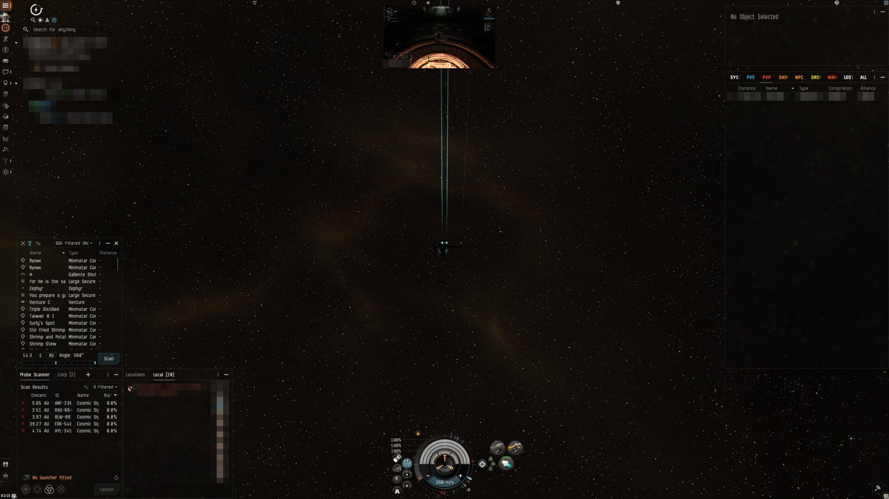
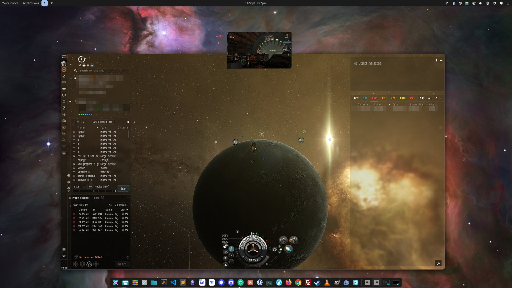
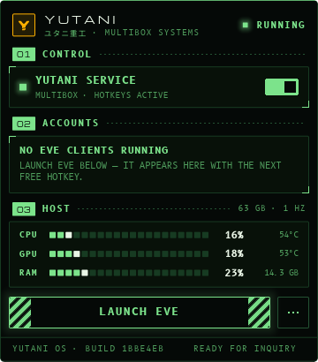

<div align="center">

<picture>
  <source media="(prefers-color-scheme: dark)" srcset="docs/logo-white.png">
  
</picture>

<br>

**Live thumbnails and one-key client switching for EVE Online multiboxing on COSMIC.**

Native Wayland. No middleware, no X11 layer, no injected DLLs. Just the latest COSMIC and Wayland protocols, a GPU and a very small daemon.

[](https://www.rust-lang.org/)
[](https://system76.com/cosmic)
[](https://wayland.freedesktop.org/)
[](packaging/PKGBUILD)
[](LICENSE)
[](https://github.com/dc9090-web/yutani/releases/latest)



*Full-screen client, second account live at the top. Press `Ctrl+Alt+2` and you are there.*

</div>

---

## ✨ What it does

Yutani watches every EVE client on your desktop and gives you two things:

| | |
| --- | --- |
| 🖼️ **Live thumbnails** | Every other client, live, in a small overlay you can put anywhere. Click one to switch. |
| ⌨️ **Global hotkeys** | `Ctrl+Alt+1…9` focuses a client, `Ctrl+Alt+←/→` steps through them, `Ctrl+Alt+T` hides the overlay. Works from inside the game. |

…plus a panel applet, a settings window, a character-settings copier and a CLI that drives all of it.

---

## 🚀 Built on the newest stack

Yutani is written in Rust against the protocols COSMIC ships today. Nothing is emulated, wrapped or polled.

| | Technology | Why it matters |
| --- | --- | --- |
| 🐧 | **Wayland, native** | The EVE client runs as a real Wayland toplevel under Proton (`PROTON_ENABLE_WAYLAND=1`). No XWayland, no window decorations from Wine. |
| 🪐 | **COSMIC 1.9** | Developed and tested on COSMIC 1.9 (cosmic-comp 1.9.0); 0.1.x was built on 1.8, and nothing since needs 1.9-only protocols. `ext-image-copy-capture` and `ext-foreign-toplevel` for per-window capture, `zwlr_layer_shell` for the overlay, COSMIC's toplevel manager for focus. `yutani doctor` lists every protocol and whether your compositor has it. |
| ⚡ | **Zero-copy capture** | Frames land in GPU `dmabuf` buffers via `gbm` and are post-processed on the GPU (scale, rounded corners). Nothing is read back to the CPU. Capture rate is yours to pick: 10, 15, 30 or 60 fps. |
| 🦀 | **One small binary** | `yutani` is the daemon, the CLI and the settings window. `yutani-applet` is the panel applet. Both come from one `cargo build`. |
| 📦 | **Arch / CachyOS** | A `PKGBUILD` builds a proper pacman package from this checkout. Upgrading is `makepkg -si` again. |

---

## 🖼️ Multiboxing

<div align="center">


*Windowed client on the COSMIC desktop. The thumbnail floats above; the panel shows Yutani's icon.*
</div>

- 👥 **Any number of accounts.** Every EVE client is picked up automatically, named by character, and given the next free hotkey.
- 🎛️ **Thumbnails are 100 % yours.** Width, opacity (20–100 %), corner radius, border colour and width, character-name label, hover zoom (up to 4×), and the capture rate.
- 📍 **Put them anywhere.** *Floating* mode drags free, with snap-to-grid and snap-to-edge against other thumbnails. *Dock* mode pins them to the top, bottom, left or right edge of the screen.
- 🧠 **Positions are remembered per character.** Log Ishukone in tomorrow and her thumbnail is where you left it. Save whole arrangements as named layouts and apply them from the applet or the CLI.
- 🖥️ **Full-screen, windowed, or fixed.** The overlay is a layer-shell surface, so it sits above a full-screen client just as happily as over a window. *Dock* mode is the fixed-position option for people who never want to drag.
- 👁️ **Show only when it matters.** Always on, or only while an EVE client has focus. Optionally hide the thumbnail of the client you are currently in.
- 🧼 **Clean clients.** `WINE_NO_WM_DECORATION=1` removes Wine's title bar; COSMIC draws the frame, or none at all in full screen.
- 🎞️ **Live even when covered.** A full-screen client hidden under another gets no frame callbacks from the compositor, and with vsync on it simply stops drawing, so its thumbnail would freeze. `yutani launch` starts each client in Mesa's mailbox present mode instead, which never waits for that callback, with DXVK's frame limiter set to your fastest display's refresh rate so nothing runs flat out. Both are plain environment variables; set either one on the launch line yourself and Yutani leaves it alone, or tune them under `launch` in `config.ron`.
- 🎨 **Follows your theme.** The active border defaults to COSMIC's accent colour, the same one the compositor outlines the focused window with.

---

## 🧭 The panel applet

<div align="center">


*The panel applet: the service switch, accounts (click one to focus it), host load and Launch EVE.*
</div>

---

## 🧬 Characters: one UI for every account

Set the overview, window positions and chat layout up once on one character, then copy them to every other character on every account from the settings window's **Characters** page.

- 📋 Pick the source character; every other character becomes a target.
- 💾 Every target is backed up first. A failed backup changes nothing.
- ↩️ One-click **Restore** brings the previous files back.
- 🔍 Yutani finds the EVE profile directory through Steam's library list, or you point it at one.

---

## 🧰 Everything else

| | |
| --- | --- |
| 🧭 **Panel applet** | A MU/TH/UR-style phosphor console: the service switch, accounts (click to focus), CPU/GPU/RAM load with temperatures, and a **▶ Launch EVE** button. Bundles its own fonts (B612 Mono, Michroma). |
| 🚀 **Launch EVE** | One press in the applet asks Steam to start EVE, minimises Steam's window if it popped up, waits while you click Play in the launcher, then shows the new client's hotkey and focuses it. A four-line log in the popover follows each step. |
| ⚙️ **Settings window** | Display, Behavior, Layouts, Characters and Steam pages. Every change is live; the file it writes is plain RON at `~/.config/yutani/config.ron`. |
| 🎮 **Steam integration** | One launch-options line makes Steam start EVE *through* Yutani, so every client is capturable and keeps drawing while covered. The Steam page prints it with a Copy button. |
| 🛰️ **Steam launch check** | If that line ever points at a `yutani` that is not there any more, Play fails silently. Yutani checks every 30 s and warns on the panel icon, in the popover and on the Steam page. |
| 🩺 **`yutani doctor`** | Prints every Wayland protocol Yutani needs and whether your compositor advertises it. |
| 🤖 **Ansible role** | `deploy/ansible/` sets up a fresh Arch/CachyOS COSMIC machine end to end. |

---

## 📦 Install

### Requirements

- COSMIC **1.9** on a Wayland session (CachyOS or Arch). It is what Yutani is developed and tested on; 1.8 should still work but is no longer tested.
- Proton with Wayland support for the clients. Tested with **GE-Proton11-6**.
- `curl` for character names (declared by the package).
- A stable Rust toolchain to build (`rustup default stable`).

### The package (recommended)

**Prebuilt:** grab the `.pkg.tar.zst` from the [latest release](https://github.com/dc9090-web/yutani/releases/latest) and install it:

```bash
sudo pacman -U yutani-*.pkg.tar.zst
```

**Or build it yourself.** `packaging/PKGBUILD` builds Yutani from this checkout into a pacman package that owns the binaries in `/usr/bin`, the icons, both desktop entries and the daemon's systemd user unit, with every runtime dependency declared.

```bash
git clone https://github.com/dc9090-web/yutani.git
cd yutani/packaging
makepkg -si            # add --nocheck to skip the test suite
```

Then, once per user:

```bash
systemctl --user enable --now yutani    # the daemon, back in a second after a crash
yutani shortcuts install                # the COSMIC keyboard shortcuts
```

Add the applet: **Settings → Desktop → Panel → Applets → Yutani**.

Upgrading is `makepkg -si` again. Every command above is idempotent; re-run them after an upgrade.

### Build from source

The package *is* the source build: `makepkg` runs `cargo build --frozen --release` on your checkout. To hack on Yutani without installing:

```bash
cargo build --frozen --release
target/release/yutani doctor        # check the compositor
target/release/yutani start         # run the daemon from the tree
cargo test                          # the suite
```

If you hand-copy `target/release/yutani` somewhere other than `/usr/bin`, use the settings window's **Steam** page: with its "Steam can't find yutani" toggle on, it prints the launch line with the running binary's real path.

### Steam

For each EVE account in Steam: **EVE Online → Properties → Launch Options**:

```
PROTON_ENABLE_WAYLAND=1 WINE_NO_WM_DECORATION=1 yutani launch -- %command%
```

`PROTON_ENABLE_WAYLAND=1` gives each client a native Wayland toplevel that Yutani can capture, `WINE_NO_WM_DECORATION=1` stops Wine drawing its own title bar, and `yutani launch` sets the game's present mode (below) before starting it. Spell the path out (`/usr/bin/yutani launch -- %command%`) if Steam cannot find `yutani` on `PATH`.

`yutani launch` also adds `MESA_VK_WSI_PRESENT_MODE=mailbox` and `DXVK_FRAME_RATE=<your fastest display's refresh rate>` to the game's environment, so a client covered by another full-screen client keeps rendering (its thumbnail stays live) without running the GPU flat out. The compositor still vsyncs the screen, so nothing tears. (Not `immediate`: Mesa only offers that on compositors with tearing control, COSMIC has none, and a rejected override leaves the game stuck in vsync.) A value you put on the launch line yourself wins, and both knobs live under `launch` in `~/.config/yutani/config.ron`:

```ron
launch: (
    unlocked_present: true,    // false: leave the game's present mode alone
    frame_rate: None,          // Some(120) for a fixed cap; None follows the display
),
```

---

## ⌨️ Everyday commands

| Command | What it does |
| --- | --- |
| `yutani start` | Start the daemon (through the user unit when installed). |
| `yutani show` / `hide` / `toggle` | Show or hide the thumbnails. |
| `yutani focus N`, `next`, `prev` | Focus a client in layout order. |
| `yutani layouts`, `yutani layout <name>` | List and apply saved layouts. |
| `yutani settings [page]` | Open the settings window. |
| `yutani status` | The daemon's state (clients, visibility, Steam launch check) as JSON. |
| `yutani doctor` | Check the compositor for everything Yutani needs. |
| `yutani quit` | Ask the running daemon to exit. |

---

## 🤖 Deploying with Ansible

`deploy/ansible/` has a playbook and a `yutani` role that does everything on this page, packages, build, applet, service and shortcuts, on a fresh Arch/CachyOS COSMIC machine, idempotently:

```bash
cd deploy/ansible
ansible-playbook -K playbook.yml -e yutani_user=<your user>
```

See [deploy/ansible/README.md](deploy/ansible/README.md) for the variables.

---

## 🛠️ Under the hood

- The daemon is a libcosmic application with no main window. Thumbnails are `zwlr_layer_shell` overlay surfaces; the settings window is an ordinary toplevel.
- Capture is per-toplevel through `ext_image_copy_capture` with `ext_foreign_toplevel_image_capture_source`. Buffers are `gbm` dmabufs when the compositor offers ABGR8888, `wl_shm` otherwise.
- A small GL pass scales each frame into a thumbnail-sized dmabuf with the corner radius baked into its alpha, so the compositor composites it directly.
- The applet is a separate process that polls the daemon's unix socket for a JSON `status`; the protocol is versioned by `serde(default)` so daemon and applet can be upgraded independently. `YUTANI_APPLET_PREVIEW=1 yutani-applet` shows the popover in an ordinary window.
- Design notes for every subsystem live in [`docs/superpowers/specs/`](docs/superpowers/specs/).

---

## 📜 License

GPL-3.0-only. EVE Online and all related marks are the property of CCP hf. Yutani is a fan-made tool and is not affiliated with or endorsed by CCP.
